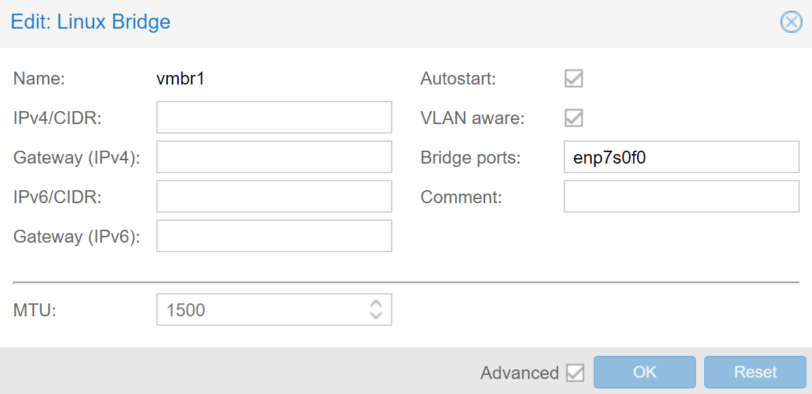
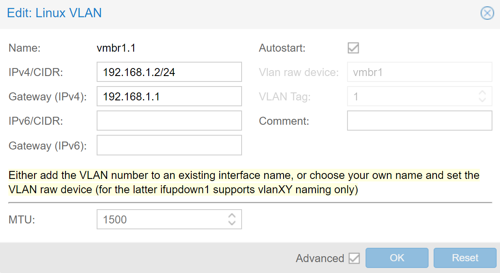
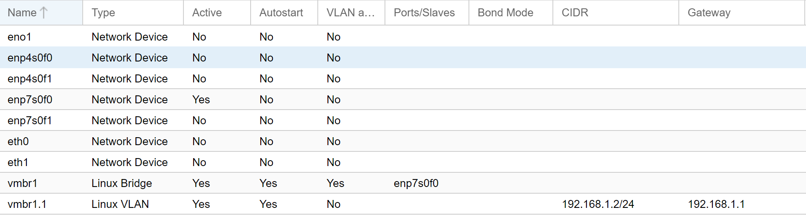
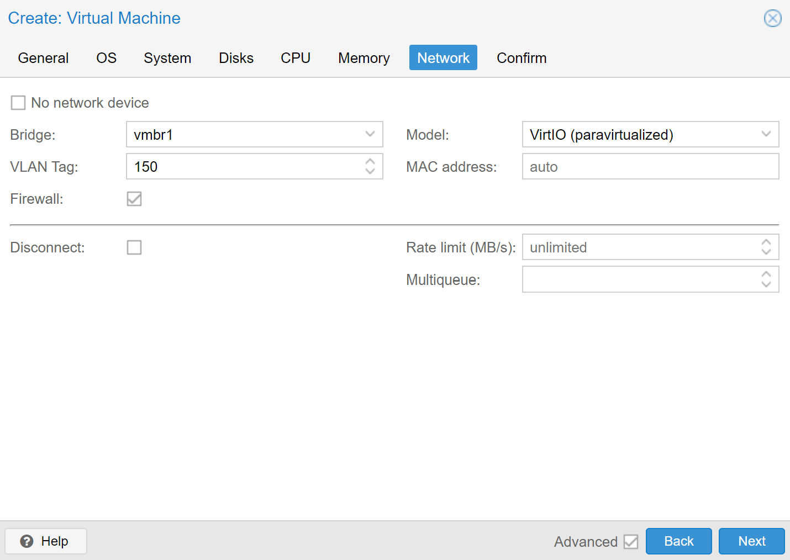
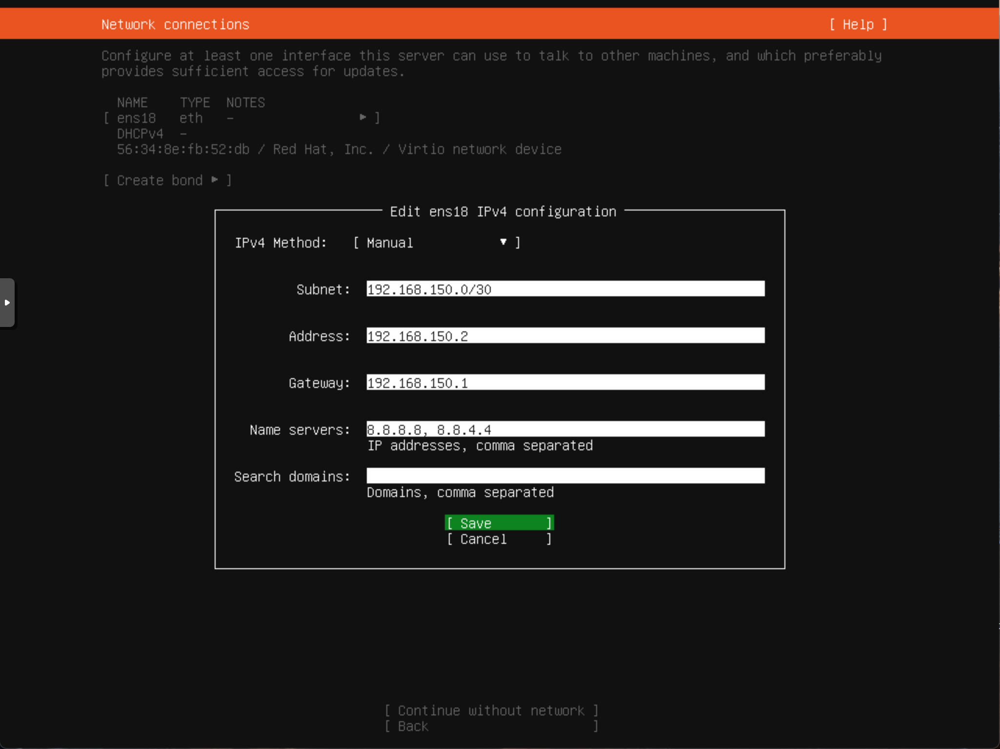
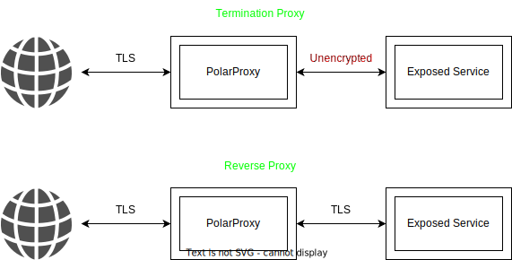

# Building a TLS-compatible Honeypot 
This guide illustrates how to set up a honeypot that, next to unencrypted network traffic, is also capable of decrypting TLS traffic with the help of [PolarProxy](https://www.netresec.com/?page=PolarProxy). It is part of my master's thesis that uses a version of this setup to analyze attacks on specific HTTP(S) web-based applications.


Note that this documentation is mostly a recollection and recreation of the events from the initial setup from the honeypot used in my thesis, and I have not tested them thoroughly again when writing this post. Therefore, if you find any mistake, feel free to open an issue or pull request or let me know otherwise!

## Infrastructure
For this setup, we use two servers. The first server, called the *Gateway Server*, runs an installation of Ubuntu 20.04. It is has two network interfaces, with one connected to the internet and assigned a /24 subnet, and the other connected to the other server.

The second server, called the *Proxmox Server*, runs [Proxmox VE](https://www.proxmox.com/en/proxmox-ve), a virtualization environment that allows us to run VMs. It is connected with an Ethernet cable to the first server but not directly to the internet. 

Usually, getting access to a /24 subnet can be quite expensive. The main reason a /24 subnet is used in this tutorial is that the project was initially done at a university with larger subnets available for research. However, given that not all IP addresses of the subnet are needed, it can also be done with smaller subnets or multiple independent IP addresses. To replicate this setup on typical cloud providers, buying multiple IP addresses and running a VPC for the internal connection between the two servers should also work.

## Initial Networking Setup
For demonstration purposes, we use the 198.51.100.0/24 test IPv4 address range as an example for our /24 subnet.

### Network Interface Configuration
The general idea of the honeypot networking is that one external IP address maps to one VM. To achieve this, we manually define the external IP addresses and also define all possible VLANs, ranging from 2-255. All VLANs use a /30 subnet, with the purpose being that only the Gateway Server and a VM can reside inside a VLAN.

On the Gateway Server, we use Netplan to configure the network. `enp4s0f0` is the network interface connected to the internet and `enp7s0f0` is the network interface that connects both servers internally.

An example configuration can look like this, with the repetitive VLAN definitions ranging to `vlan.255` cut out (a full version can be found in [netplan.yaml](netplan.yaml)):

```yaml
network:
  version: 2
  ethernets:
    enp4s0f0:
      addresses: 
        - 198.51.100.42/24 # Gateway server external IP address 
        - 198.51.100.4/24 # One Honeypot Service
        - 198.51.100.12/24 # Another Honeypot Service
      gateway4: 198.51.100.1
      dhcp4: false
      nameservers:
        addresses: [8.8.8.8, 8.8.4.4]
    enp7s0f0:
      dhcp4: false
      addresses: [192.168.1.1/30]
  vlans:
    vlan.2:
      id: 2
      dhcp4: false
      link: enp7s0f0
      addresses: [192.168.2.1/30]
    vlan.3:
      id: 3
      dhcp4: false
      link: enp7s0f0
      addresses: [192.168.3.1/30]
    ...
```

It is possible to define the whole subnet for the external IP addresses at one go instead of each IP defined manually. However, given that we did not want to route traffic to our machine for unassigned IP addresses, we decided to opt for the latter option. This should also allow an easier adaption in case a whole /24 subnet is not available, but rather multiple IP addresses. These can be defined in the same way in this configuration.

### Firewall
By default, we do not want to allow any incoming traffic to either the Gateway Server or the VMs that is not intended by us. Traffic to the Gateway Server itself is considered as `INPUT` in iptables, whereas traffic for the VMs is considered as `FORWARD`. 

Before we drop all access by default, we need to ensure we still keep access before applying the firewall rules. First, we set an allowed subnet from which we can continue to access everything:

```bash
sudo iptables -A INPUT -i enp4s0f0 -s 192.0.2.0/24 -j ACCEPT
```

Note that `192.0.2.0/24` is used as a placeholder here to specify a subnet that is allowed to access the Proxmox management interface and SSH. It can be replaced with another specific subnet or IP address that is allowed to access these services. 

Then, we need to ensure that outgoing traffic is still allowed when initiated from an allowed `INPUT` or `FORWARD` rule:

```bash
sudo iptables -A INPUT -m conntrack --ctstate ESTABLISHED,RELATED -j ACCEPT
```

After we specifically allowed incoming traffic from a trusted network and outgoing traffic back to it to ensure we do not lock ourselves out, we can eventually drop all other traffic by default:

```bash
sudo iptables -P INPUT DROP
sudo iptables -P FORWARD DROP
```

Additionally, we can allow traffic for loopback traffic by default:
```bash
sudo iptables -A INPUT -i lo -j ACCEPT
sudo iptables -A OUTPUT -o lo -j ACCEPT
```

### Access to the Proxmox Server
The Proxmox installation on the second server is configured with the IP address 192.168.1.2 and runs outside of a VLAN. To gain access to SSH and the Proxmox management interface on the second server, we setup the following `iptable` rules on the Gateway Server that offer access to both services under the same external IP address as the Gateway Server:
```bash
# Proxmox management interface
sudo iptables -A FORWARD -s 192.0.2.0/24 -d 192.168.1.2 -p tcp --dport 8006 -j ACCEPT
sudo iptables -A FORWARD -s 192.168.1.2 -d 192.0.2.0/24 -p tcp --sport 8006 -j ACCEPT
sudo iptables -A PREROUTING -t nat -p tcp -s 192.0.2.0/24  --dport 8006 -j DNAT --to-destination 192.168.1.2:8006

# SSH
sudo iptables -A PREROUTING -t nat -p tcp -s 192.0.2.0/24  --dport 2222 -j DNAT --to-destination 192.168.1.2:22
sudo iptables -A FORWARD -s 192.0.2.0/24 -d 192.168.1.2 -p tcp --dport 22 -j ACCEPT
sudo iptables -A FORWARD -d 192.0.2.0/24 -p tcp --sport 22 -j ACCEPT
```

The same note as above applies for `192.0.2.0/24`.

In addition, we still want Proxmox itself to be able to reach the internet for updates. Therefore, we add the additional following rules to allow Proxmox to masquerade its traffic under the same external IP address as the Gateway Server:

```bash
sudo iptables -t nat -A POSTROUTING -s 192.168.1.2 -j MASQUERADE
sudo iptables -A FORWARD -d 192.168.1.2 -m conntrack --ctstate ESTABLISHED,RELATED -j ACCEPT
sudo iptables -A FORWARD -s 192.168.1.2 -o enp4s0f0 -j ACCEPT
```

### Configuring VLAN support for Proxmox
In order to eventually be able to assign VLANs per VM, we need to do some additional networking configuration in Proxmox.
Assuming that previously, the Proxmox network configuration was done over a **Network Device** in Proxmox, we need to make some changes to be able to define VLANs on the side of the Proxmox Server. 

Under the "Networking" tap in Proxmox, we need to create a **Linux Bridge** and a **Linux VLAN** that uses the newly created bridge device for VLAN 1. 

The **Linux Bridge** itself needs to be configured as VLAN-aware, with the Bridge ports being the Network Device for the internal connection between the two servers, presumably the same network device configured before. In our case, similar to the Gateway Server, this is `enp7s0f0`.



Then, for the **Linux VLAN**, VLAN 1 holds the same configuration as the Network Device did before and is required to keep being able to be still able to reach the server under the same internal IP address over the Gateway Server as before. The screenshots below show the setting we used for each device, with vmbr1 being the Linux Bridge and vmbr1.1 being the Linux VLAN:




Afterward, we can remove the IP address from the Network Device and apply the changes. 

In total, the network configuration should look similar to this (with disregard to the inactive network interfaces shown):



## VM Setup
With the initial setup being done, we can now create VLANs that use the newly created Linux Bridge device `vmbr1` and assign a VLAN tag to use for the VM. For example, for a VM that, under the /24 subnet example, is supposed to be reachable under 198.51.100.150 from the Internet or 192.168.150.2 internally from the Gateway Server, we would use the VLAN tag 150. 



Additionally, if rate limiting is desired in case any malicious services are running when a VM gets infected, it can also be configured under the same networking tab directly in Proxmox.

Before we install any operating system inside the VM, it makes sense to create the networking rules for a single VM before we install any VM. Here, we distinct between VMs where we do not want to intercept any incoming TLS traffic, and VMs for which we do.

### Non-TLS Traffic
For VMs not running any TLS-enabled services, we create the following rules:

* Incoming traffic for a specific external IP address is translated to the internal IP address of the respective VM (DNAT)
* Outgoing traffic from a specific VM is translated to its specific external IP address (SNAT)
* Incoming traffic is only allowed for a specific port and already established connections (important to keep outgoing traffic alive)
* Outgoing traffic is fully allowed, except to other VMs

For `iptables`, this can be translated into the following rules:

```bash
sudo iptables -t nat -A PREROUTING -d 198.51.100.XX/32 -j DNAT --to-destination 192.168.XX.2
sudo iptables -t nat -A POSTROUTING -s 192.168.XX.2/32 -j SNAT --to-source 198.51.100.XX
sudo iptables -A FORWARD -s 192.168.XX.2 -o enp4s0f0 -j ACCEPT
sudo iptables -A FORWARD -d 192.168.XX.2 -m conntrack --ctstate ESTABLISHED,RELATED -j ACCEPT
sudo iptables -A FORWARD -d 192.168.XX.2 -p tcp --dport YY -m iprange ! --src-range 192.168.0.0-192.168.255.255 -j ACCEPT

# In case Docker is installed, forbid traffic to Docker networks by default
sudo iptables -I DOCKER-USER -s 192.168.XX.2 -d 172.16.0.0/12 -m state --state NEW -j DROP 
```

XX is a place holder for the VLAN tag, and YY the port of a service we want to allow for the outside. 


### TLS Traffic
When we want to intercept incoming TLS traffic with the help of [PolarProxy](https://www.netresec.com/?page=PolarProxy), it will be running on the Gateway Server itself, and not inside the VM. Therefore, we need to create an exception for the routing rules that incoming ports expecting TLS are not directly forwarded to the VM:

```bash
sudo iptables -t nat -A PREROUTING -d 198.51.100.XX/32 -j DNAT -p tcp --to-destination 192.168.XX.2 ! --dport YY
sudo iptables -t nat -A PREROUTING -d 198.51.100.XX/32 -j DNAT --to-destination 192.168.XX.2 ! -p tcp
sudo iptables -t nat -A POSTROUTING -s 192.168.XX.2/32 -j SNAT --to-source 198.51.100.XX
sudo iptables -A FORWARD -s 192.168.XX.2 -o enp4s0f0 -j ACCEPT
sudo iptables -A FORWARD -d 192.168.XX.2 -m conntrack --ctstate ESTABLISHED,RELATED -j ACCEPT
sudo iptables -A INPUT -d 198.51.100.XX -p tcp --dport YY -m iprange ! --src-range 192.168.0.0-192.168.255.255 -j ACCEPT

# In case Docker is installed, forbid traffic to Docker networks by default
sudo iptables -I DOCKER-USER -s 192.168.XX.2 -d 172.16.0.0/12 -m state --state NEW -j DROP 
```

Here, we instruct the system not to forward TCP port YY to the VM directly, but all other TCP and UDP traffic is passed through, similar to the Non-TLS traffic. 

### VM Network Configuration
With these rules set in place, we can install the operating system inside the VM. For the network configuration, we use a static configuration with the following settings:

* **Subnet**: 192.168.XX.0/30 (**Subnet Mask**: 255.255.255.252)
* **IP Address**: 192.168.XX.2
* **Gateway**: 192.168.XX.1
* **DNS**: 8.8.8.8, 8.8.4.4 (replaceable with other public DNS servers)

An example configuration for Ubuntu 20.04 with the VLAN tag 150 is shown here:


After installation, the VM should be able to access the internet. The desired honeypot service running under port YY defined with the iptables rules above can now be installed and, in case of a non-TLS port, should be exposed to the internet after installation. For a TLS port, we need to start PolarProxy in the next step before it is eventually exposed to the internet.

## Capturing Network Traffic
Now that we have our service up and running, we can start by capturing the network traffic from our Gateway Server. Here, we take a look at the global traffic (useful for unencrypted traffic) and how to capture the TLS traffic for the ports we made an exemption before.
### Complete Network Traffic
To capture the global traffic of a VM, we can leverage [TShark](https://www.wireshark.org/docs/man-pages/tshark.html), which is a Terminal version of Wireshark. 

After installation, we can capture the network traffic of the VM by telling TShark to capture traffic on the network interface `vlan.XX`, with XX being the VLAN tag.

As an example, to capture traffic for the VM on VLAN tag 150, we can use the following command:
```bash
tshark -i vlan.150 -w /mnt/data/pcaps/vlan150.pcap
```

When the capture is running for a longer while, or when the VM is experiencing high traffic, it can result in either dropped packages or very large PCAP files that are hard to analyze in tools like Wireshark. Therefore, a good idea is to increase the capture buffer size with `-B`, and the ring buffer size with `-b` which automatically rotates to a new PCAP file.

For example, using a capture buffer size of 256 MB and a maximum PCAP size of 1 GB before rotating would look like this:

```bash
tshark -B 256 -b filesize:1000000 -w /mnt/data/pcaps/vlan150.pcap
```

### TLS Traffic
In order to host TLS service and being able to capture incoming traffic, we now leverage PolarProxy running on the Gateway Server. First, after downloading and unpacking the most recent version from the [website](https://www.netresec.com/?page=PolarProxy), we add the capability to allow PolarProxy to listen on ports <1024 without requiring to run it as root or with sudo:

```bash
sudo setcap 'cap_net_bind_service=+ep' /path/to/unpacked/PolarProxy
```
Afterward, we distinct between the two cases **Termination Proxy** and **Reverse Proxy**. The former is used when the server inside the VM is not running with TLS or also accepts unencrypted connections, the latter when the service inside the VM exposes a TLS port.




To launch PolarProxy in **Termination Proxy** mode, we can use the following command:

```bash
./PolarProxy -p 198.51.100.XX,YY,YY,ZZ -cn "<INSERT TLS CN NAME HERE>" -o /mnt/data/pcaps/ --terminate --connect 192.168.XX.2 --nosni 198.51.100.XX -v 
```

Here, the IP address specified in `-p` and `--nosni` is the external IP address we reserved for the single VM. In case the honeypot is not just reachable by the IP address, but under a domain or other DNS name, `--nosni` should be the domain name or DNS name.

The ports in `-p` define in the given order that:

* We want to listen on port YY
* Decrypted traffic should be stored as port YY in the PCAP
* We want to connect to port ZZ on the specified IP address in `-connect`

 `--connect` holds the internal IP address and `--terminate` defines that we want to terminate connect to the specified. The `-cn` argument defines the Common Name PolarProxy should use for the dynamically generated TLS certificate. While it is optional to use, it makes sense to define a manual one for a honeypot, given that we do not want to advertise to the outside world that PolarProxy is running on this port. Alternatively, a static server certificate can be used with the `--servercert` option.

For **Reverse Proxy** mode, we essentially only need to remove the `--terminate` option and adjust the target port for the `-p` argument. 

However, in the case of a honeypot, it often makes sense to use the same certificate as the underlying service that is running TLS. Given that PolarProxy expects the more unusual `.p12` format that contains both the certificate and the private key in one file, we likely first need to obtain the certificate and private key from inside the VM, and convert them with the following command:

```bash
openssl pkcs12 -export -out cert.p12 -in cert.pem -inkey key.pem
```

OpenSSL will prompt for a password, for which we can just use a value such as `12345` or a more complex value, if desired.


With these adjustments, we can launch PolarProxy in Reverse Proxy mode with a fixed server certificate, using the same certificate and key as the service inside the VM:
```bash
./PolarProxy -p 198.51.100.XX,YY,YY,YY -o /mnt/data/pcaps/ --connect 192.168.XX.2 --nosni 192.168.XX.2 -v --servercert 198.51.100.XX,192.168.XX.2:/path/to/cert.p12:12345
```

Again, if the honeypot is reachable under a domain or another DNS name, `--nosni` needs to hold the domain or DNS name, and the same name should be appended to the `--servercert` argument which also holds the list of domains the specified TLS certificate should be used for.

When running **PolarProxy in combination with TShark**, it can make sense to exclude the TLS port from the TShark capture to avoid bloated PCAP files containing redunant encrypted traffic. This can be achieved with a capture filter in TShark:

```bash
tshark -i vlan.XX -w /mnt/data/pcaps/vlanXX.pcap -f "not ((src net 192.168.XX.1 and src port YY) or (dst net 192.168.XX.1 and dst port YY))"
```


## Suricata (IDS)
In order to be alerted of incoming attacks, it makes sense to install an IDS that monitors the network traffic for known attacks. For this case, we use [Suricata](https://suricata.readthedocs.io/en/latest/install.html#binary-packages), which can also monitor TLS traffic when combined with PolarProxy.

### Installation
For the installation, we refer to the [binary package installation guide](https://suricata.readthedocs.io/en/latest/install.html#binary-packages) in the official documentation. For a broader level of attack detection, it might make sense to enable additional sources for rules.

The list of default sources for rules can be queried with the first command, and single sources can be enabled with the second command:
```bash
suricata-update list-sources # Query the list of available sources
suricata-update enable-source <source-name> # Enable a specific source
```

### Adding dummy network interfaces for TLS traffic
*(This step can be skipped if we do not want to monitor TLS traffic with Suricata)*

Suppose we want to pipe the decrypted TLS traffic from PolarProxy to Suricata. In that case, we need to create one or multiple dummy network interfaces which Suricata can listen on next to the internet-connected network interface. Unfortunately, netplan does not support the creation of  (persistent) dummy network interfaces. Therefore, we manually create a dummy network interface which is not persistent across reboots:

```bash
sudo ip link add polarproxytls type dummy
```

### Configuration
While the specific detection settings are different for each use case, the main changes we need to perform to the Suricata configuration are to adjust the `HOME_NET`, and to add any dummy network interfaces for use with PolarProxy.

For `HOME_NET`, it makes sense to add the external IP address for a complete monitoring of the whole honeypot network:
```yaml
HOME_NET: "[192.168.0.0/16,10.0.0.0/8,172.16.0.0/12,198.51.100.XX/24]"
```

Then, for the network interfaces, we specifically defined only the internet-connected facing network interface to avoid capturing all possible VLAN interfaces with duplicate and redundant traffic, and the dummy interface created for PolarProxy:

```yaml
af-packet:
  - interface: enp4s0f0
    cluster-id: 1
    cluster-type: cluster_flow
    defrag: yes
    buffer-size: 131072
    
  - interface: polarproxytls
    cluster-id: 2
    cluster-type: cluster_flow
    defrag: yes
```

Further adjustments can be made for other detection related settings. 

To start Suricata and let it autostart upon reboot, we can use:
```bash
sudo systemctl enable filebeat
sudo systemctl start filebeat
```

### Pipe TLS traffic to the dummy network interface
To pipe any traffic from PolarProxy to the dummy network interface Suricata listens on, we use PolarProxy's PCAP-over-IP capabilities combined with `tcpreplay`.

First, we need to allow loopback traffic so that `tcpreplay` can connect to any PCAP-over-IP ports from PolarProxy. 

We can either create a blanket rule that allows unrestricted flow of loopback traffic:
```bash
sudo iptables -A INPUT -i lo -j ACCEPT
sudo iptables -A OUTPUT -o lo -j ACCEPT
```

Alternatively, a specific rule to only allow a single port can also be used, with 4430 being a replaceable example port we use for PCAP-over-IP.

```bash
sudo iptables -A INPUT -i lo -p tcp --dport 4430 -j ACCEPT
```

Then, we can append `--pcapoverip 4430` to the PolarProxy arguments, start PolarProxy and in another terminal session, launch `tcpreplay`:
```bash
nc localhost 4430 | sudo tcpreplay -i polarproxytls -t -
```

More details and information on how to make this setup persistent can be found in a [blog post from NETRESEC](https://www.netresec.com/?page=Blog&month=2020-01&post=Sniffing-Decrypted-TLS-Traffic-with-Security-Onion).

## ELK (Gateway Machine)
The Elastic toolset provides a wide variety of valuable tools for SIEM. In our use case, we can use it to store and analyze the networking data from the Gateway Server but also collect events from inside the VMs themselves, such as executed commands or other suspicious activities detected by [Falco](https://falco.org/). 

Unfortunately, given that the setup from the master's thesis was based on Elasticsearch 7, with Elasticsearch 8 having made many changes concerning TLS, the same configuration does not make sense to use in the same way as before anymore. Therefore, this section provides a relatively high-level view of how to combine each tool, with the details being omitted.


### ElasticSearch (Installation in Docker)
We assume that ElasticSearch are installed inside a Docker container on the Gateway Machine. An example of setting ElasticSearch and Kibana up together can be [the docker-compose example](https://www.elastic.co/guide/en/elasticsearch/reference/current/docker.html#docker-compose-file) listed in the documentation for ElasticSearch. While it seems wasteful to have a multi-node setup running on the same host machine in terms of resources, it can lead to funky behavior later down the road when modifying the `docker-compose.yml` file to only run as a single node.

To harden the ElasticSearch setup and break any isolation between the different VMs, we disallow it to create any new outgoing connections to the VMs. Only connections initiated by the VMs should be accepted:
```bash
sudo iptables -I DOCKER-USER -s 172.16.0.0/12 -m state --state NEW -m iprange --dst-range 192.168.0.0-192.168.255.255 -j DROP
```

In addition, we again only want to allow a specific trusted subnet to be able to access both Elasticsearch and Kibana from outside the machine, with all other connections being dropped:

```bash
sudo iptables -I DOCKER-USER -i enp4s0f0 -p tcp -m conntrack --ctorigdstport 5601 ! -s 192.0.2.0/24 -j DROP
sudo iptables -I DOCKER-USER -i enp4s0f0 -p tcp -m conntrack --ctorigdstport 9200 ! -s 192.0.2.0/24 -j DROP
```

Same as before, replace `192.0.2.0/24` with your trusted subnet or IP.

### Filebeat & Packetbeat
On the Gateway Server, we install Filebeat to collect the Suricata events, and Packetbeat to create visualizations for the network traffic.

Both services are installed outside of Docker, using the `.deb` releases using the official installation tutorial [for Filebeat](https://www.elastic.co/guide/en/beats/filebeat/current/filebeat-installation-configuration.html#installation) and [for Packetbeat](https://www.elastic.co/guide/en/beats/packetbeat/current/packetbeat-installation-configuration.html#installation). Note that while using APT is also possible, unexpected upgrades can break parts of the installation, either when using inconsistent versions, or when using API keys with tight permissions (as we do later).

Both links also provide general short instructions on how to connect both Beats to Elasticserach. For the Gateway Server, we can use `localhost:9200` as the address. However, in case you did not set up the loopback firewall rules before, you either need to add the blanket "allow all loopback" traffic rule from before, or add the following specific exemptions:

```bash
sudo iptables -A INPUT -i lo -p tcp --dport 5601 -j ACCEPT
sudo iptables -A INPUT -i lo -p tcp --dport 9200 -j ACCEPT
```

For both tools, as stated in each installation tutorial, it makes sense to configure `setup.kibana` section in the config to automatically create dashboards in Kibana. In the setup from the thesis, two Kibana spaces in combination with the optional `space.id` parameter were used to distinct between the data from the Gateway Machine, and the data from the VMs.

For **Filebeat**, we enable the optional Suricata module to collect data from the Suricata EVE logs. This option needs to be enabled in Suricata, which it is by default.

First, we enable the module:
```bash
sudo filebeat modules enable suricata
``` 

Then, we can specify the path for the file in `/etc/filebeat/modules/suricata.yml`. In our case, this matches the default configuration:

```yml
- module: suricata
  eve:
    enabled: true
    var.paths: ["/var/log/suricata/eve.json"]
```


Afterward, we can call eventuelly start Filebeat:
```bash
sudo filebeat setup
sudo systemctl enable filebeat
sudo systemctl start filebeat
```

For **Packetbeat**, after the general connection setup to Elasticsearch and Kibana, we add or modify the following entries in the configuration:

```yaml
# Only listen on the internet-connected interface, similar to Suricata
packetbeat.interfaces.device: enp4s0f0

# Enable af_packet with a slightly increased ring buffer size
packetbeat.interfaces.type: af_packet
packetbeat.interfaces.buffer_size_mb: 150

# Enable GeoIP enrichment
output.elasticsearch.pipeline: geoip-info
```

Now, we can start Packetbeat in the same fashion as Filebeat:
```bash
sudo filebeat setup
sudo systemctl enable filebeat
sudo systemctl start filebeat
```

After the initial launch, if you did not already do it before, we can downgrade the credentials to the least possible privilege by creating an API key with minimal permissions for adding new entries. While this is not strictly necessary for the Gateway Machine, given that it is part of the "Trusted" infrastructure, it might still prevent some harm. Examples on how to create such an API key can be found in the official documentation for [Filebeat](https://www.elastic.co/guide/en/beats/filebeat/current/beats-api-keys.html#beats-api-key-publish) and for [Packetbeat](https://www.elastic.co/guide/en/beats/filebeat/current/beats-api-keys.html#beats-api-key-publish).

### Logstash (Gateway Server, Slack Alerts)
In addition to the Beats, Logstash can be used on the same Suricata EVE log to send alerts to a Slack channel when high-severity attacks were detected.

To replicate this, [install Logstash](https://www.elastic.co/downloads/logstash) and the 3rd-party [Slack Output Plugin](https://github.com/logstash-plugins/logstash-output-slack). Then, a Logstash configuration needs to be added. An example which automatically sends Suricata alerts with "Level 1" severity can be found [here](logstash-suricata.conf), though from personal experience, it can be quite noisy and therefore might need further adjustments. The configuration file(s) need to be copied to `/etc/logstash/conf.d`, and afterward, Logstash can be started:

```bash
sudo systemctl enable logstash
sudo systemctl start logstash
```


## ELK & Falco (VMs)
After describing the setup on the Gateway Machine in the previous section, we now switch to the configuration inside the VM that allows us to track the behavior of attackers and additional generic metrics data. Note that this setup is not 100% ideal, given that everything runs as user-space processes which attackers can potentially kill or steal the credentials for. However, due to a lack of commonly available kernel-level surveillance modules for recent kernel versions, we use a common SIEM-based approach with tight permissions that should prevent the abuse of the Elasticsearch server.

### Falco
Before we set up the Beats, we first install Falco using the official [installation guide](https://falco.org/docs/getting-started/installation/#installing). While Falco is primarily focused on container-based attacks, it nevertheless contains useful rules for other kinds of attacks and suspicious activities. 

Before we start Falco, we need to enable the file output in the configuration in order for Filebeat to be able to collect any data for Falco. This can be achieved by creating the necessary directory:

```bash
sudo mkdir /var/log/falco
```

And adding the following entry to `/etc/falco/falco.yaml`
```yaml
file_output:
  enabled: true
  keep_alive: false
  filename: /var/log/falco/falco.json
```

Afterwards, Falco can be started:
```bash
sudo systemctl enable falco
sudo systemctl start falco
```

### Auditbeat, Filebeat, Metricbeat
Similar as for the Gateway machine, [Auditbeat](https://www.elastic.co/guide/en/beats/auditbeat/current/auditbeat-installation-configuration.html#install), [Filebeat](https://www.elastic.co/guide/en/beats/filebeat/current/filebeat-installation-configuration.html) and [Metricbeat](https://www.elastic.co/guide/en/beats/metricbeat/current/metricbeat-installation-configuration.html) can be installed and configured following the official installation tutorial.

For the Elasticsearch server IP address, we need to use the internal IP address of the Gateway Server for `output.elasticsearch.hosts`:
```yaml
output.elasticsearch:
  hosts: ["192.168.XX.1:9200"]
```

In addition, on the Gateway Server, we need to add an additional rule to allow a VM to make a connection to Elasticsearch:
```bash
sudo iptables -I DOCKER-USER -s 192.168.XX.2 -d 172.16.0.0/12 -p tcp --dport 9200 -m state --state NEW -j ACCEPT
```

Given that the VMs run in an untrusted environment, the use of API keys is of very importance to prevent potential attackers from compromising the Elasticsearch server. However, on the very first use of the tools, the necessary indices are not created yet in Elasticsearch. The same applies to the Kibana dashboards, especially when running under a different `space.id`. Therefore, it either makes sense to run this setup in one trusted VM first with admin credentials (which should be securely wiped after the initial setup), or adapt the API key permissions to allow the creation of indicies and other required options. Following the principle of least privilege, the first option is preferable with an ephemeral trusted VM that is created to validate the setup and destroyed afterwards without any exposure to attackers.

But before we initally run each Beat, we make the following changes to the configuration:

1. For **Auditbeat**, we need to add audit rules which Auditbeat should pass to the Linux kernel. For the setup in the thesis, a slightly modified ruleset from [Florian Roth's Auditd rules](https://github.com/Neo23x0/auditd), with incompatible rules for Auditbeat and Ubuntu 20.04 being removed. The used rules can be found as part of this repository in [audit-rules.conf](audit-rules.conf), though the rules might not be ideal for every use case and outdated after time of this writing.

2. To integrate Falco with **Filebeat**, we need to add the following input to `/etc/filebeat/filebeat.yml`:
```yaml
filebeat.inputs:
- type: filestream
  enabled: true
  paths:
    - /var/log/falco/falco.json
  parsers:
    - ndjson:
      keys_under_root: true
      add_error_key: true
  index: "falco-%{+yyyy.MM.dd}"
  ```

With all configurations into place, we can finally do an initial run for each tool using admin credentials or privileged API keys from a trusted VM.

After the initial run, we can create API keys with the least required permissions to be used inside the honeypot VMs. We can use the official documentation to create the API keys for [Auditbeat](https://www.elastic.co/guide/en/beats/auditbeat/master/beats-api-keys.html#beats-api-key-publish) and [Metricbeat] (https://www.elastic.co/guide/en/beats/metricbeat/current/beats-api-keys.html#beats-api-key-publish).

For Filebeat, due to the additional Falco index, we need to slightly adapt the API key example from the documentation:

```json
POST /_security/api_key
{
  "name": "filebeat_hostXXX", 
  "role_descriptors": {
    "filebeat_writer": { 
      "cluster": ["monitor", "read_ilm", "read_pipeline"],
      "index": [
        {
          "names": ["filebeat-*"],
          "privileges": ["view_index_metadata", "create_doc"]
        },
        {
          "names": ["falco-*"],
          "privileges": ["view_index_metadata", "create_doc"]
        }
      ]
    }
  }
}
```

